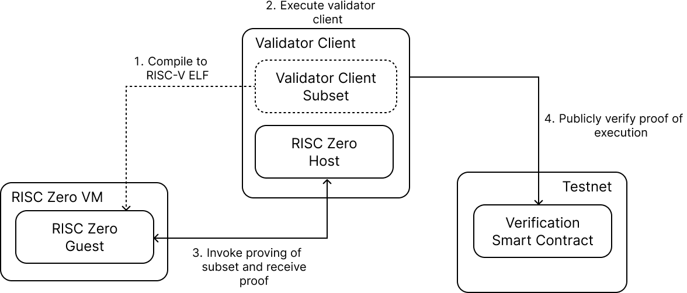

# Verifiable Client Diversity

The goal of this project is to devise a way to prove and verify the use of diverse client implementations in the Ethereum blockchain.

Our vision and motivation are described in our whitepaper: [https://arxiv.org/abs/2411.18401](https://arxiv.org/abs/2411.18401)

In this document we describe the technical details of our first prototype implementation.

# Prototype 0

With this prototype we focus on creating a **Client Implementation Proof of Execution using a zkVM**, as mentioned in Section 4.1 of our whitepaper.

Specifically, we aim to test the feasibility of proving and verifying the execution of a sub-set of a single client implementation.

For proving, we rely on a state-of-the-art zero knowledge execution environment, which is able to execute and produce a proof of execution of an arbitrary subset of the selected client implementation.

For verification we rely on existing verification mechanisms for the corresponding zero knowledge execution environment. 

We implement the mentioned functionality in a local testnet in order to tackle implementation challenges and to locally measure proving times and validation feasibility. 

### Implementation

We implement the prototype in the Lighthouse client, and use RISC Zero to produce proofs of execution.

Figure 1 shows an overview of Prototype 0. It consists of 3 main components:

1. A modified [Lighthouse validator client](https://github.com/ASSERT-KTH/lighthouse).
2. A [RISC-V ELF of the lighthouse BLS signature dependency](https://github.com/ASSERT-KTH/lighthouse/blob/risc0-test/methods/guest/src/main.rs) (supranational/blst).
3. A [local testnet with the RISC Zero Groth-16 verifier contract](https://github.com/ASSERT-KTH/lighthouse/blob/risc0-test/network-params.yaml).

The process is executed as follows:

1. Before any execution, the RISC-V ELF is created from the current BLST dependency version.
2. The validator client is executed, with at least one validator key loaded.
3. At block proposal time, the validator client performs its duties as it would normally do. However it wil[l concurrently start a process to re-compute the BLS](https://github.com/ASSERT-KTH/lighthouse/blob/4b8f5e322d1a4f4a87748861d06f6d12cc14f3c1/validator_client/signing_method/src/lib.rs#L186) signature of the proposed block: this is the computation that produces a proof of execution.
4. The proof is sent in a transaction to the verifier smart contract, and publicly validated.

This process is repeated for every block that the validator is assigned to produce.

Figure 1: Overview of Prototype 0

The prototype is available at: [https://github.com/assert-kth/lighthouse](https://github.com/assert-kth/lighthouse). Instructions in how to run are included in the [`README.md`](http://README.md) file.

## Observations and Future Work

**Observation 1**

In our system, the observed proving time of BLS signature was ~1 hour. This long proving time forcefully requires that proving is performed as a parallel and asynchronous process. This means that the actual signature that is performed by the validator client (and included in the block) is not the one that proof is provided for. If the client operator is honest, the proof will mirror the original signature computation; but if it’s not, then the proof can easily be spoofed.

To tackle this limitation, the proving time has to be much shorter, so that the signature and proof are provided at the same time; ideally within the same block time.

We plan to experiment with:

1. Other program sub-sets of validator clients, which could potentially be able to be proved faster.
2. GPU acceleration.
3. Program-specific circuits (e.g. https://github.com/sp1-patches/bls12_381)

Furthermore, we plan to experiment with with other execution attestation mechanism instead, such as execution the program sub-sets signature in a TEE.

**Observation 2**

Currently, the ELF is created only from library code, which means that the proof is not linked to any specific client implementation. 

To tackle this issue, the code that wraps the library should be used in the proof as well. The more client code is included, the stronger the guarantee of a specific client being used. This however, has the downside of introducing even longer proving times.
